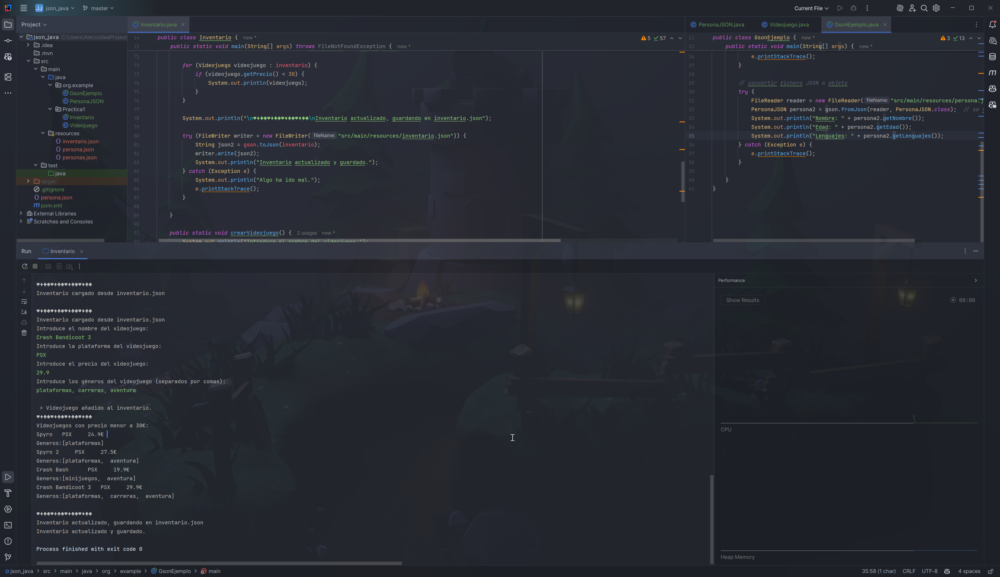

# Serialización de objetos

 JSON y APIs

## Práctica 1

Crea un programa en *Java* que gestione el inventario de una tienda de videojuegos.

Cada videojuego debe tener:

- Nombre del juego.
- Plataforma (por ejemplo: PC, PS5, Xbox).
- Precio.
- Disponible (booleano).
- Una lista de géneros (acción, estrategia, etc.).

El programa debe:

a) Crear 3 videojuegos distintos **por consola** y guardarlos en una colección.

b) Guardar toda la colección en un archivo *JSON* (***videojuegos.json***).

c) Leer ese archivo y mostrarlo por pantalla.

d) Reconstruir la colección de objetos *Java* a partir del archivo guardado.

e) Añadir un videojuego nuevo a la colección.

f) Mostrar en consola los videojuegos cuyo precio sea menor a 30€.

g) Volver a guardar la lista actualizada en el archivo *JSON*.

## Práctica 2

Replica los pasos anteriores para consumir la API que tú quieras. Si no se te ocurre cuál, usa alguna de estas:

- ***CoinGecko API – Criptomonedas***. Consulta precios de *Bitcoin, Ethereum*, etc. en tiempo real.

URL ejemplo:  
https://api.coingecko.com/api/v3/simple/price?ids=bitcoin,ethereum&vs_currencies=usd,eur  

- ***Open Trivia DB***. Preguntas de trivial por categoría, dificultad, etc.

URL ejemplo:

https://opentdb.com/api.php?amount=1&category=18  

Webs para encontrar APIs:

- [RapidAPI](https://rapidapi.com/hub)
- [https://public-apis.io/](https://public-apis.io/)
- [GitHub - public-apis/public-apis: A collective list of free APIs](https://github.com/public-apis/public-apis)
- [https://apilist.fun/](https://apilist.fun/)

